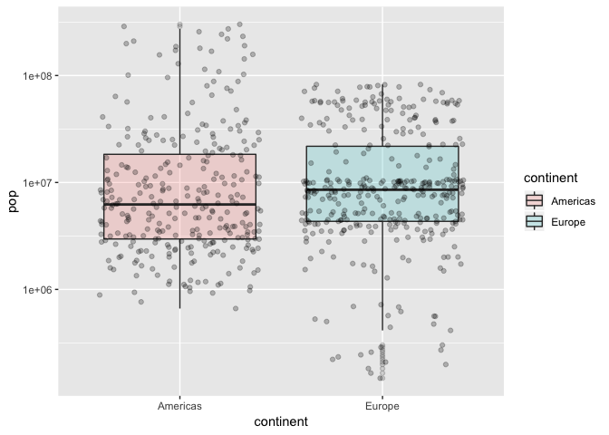

Homework 02: Explore Gapminder and use dplyr
================

Load the gapminder and tidyverse library

``` r
library(gapminder)
library(tidyverse)
```

    ## ── Attaching packages ──────────────────────── tidyverse 1.2.1 ──

    ## ✔ ggplot2 3.0.0     ✔ purrr   0.2.5
    ## ✔ tibble  1.4.2     ✔ dplyr   0.7.6
    ## ✔ tidyr   0.8.1     ✔ stringr 1.3.1
    ## ✔ readr   1.1.1     ✔ forcats 0.3.0

    ## ── Conflicts ─────────────────────────── tidyverse_conflicts() ──
    ## ✖ dplyr::filter() masks stats::filter()
    ## ✖ dplyr::lag()    masks stats::lag()

### Smell test the data

Object gapminder is a list. It can be determined by “typeof()” command:

``` r
typeof(gapminder)
```

    ## [1] "list"

Object gapminder is a class of tbl\_df. tbl\_df object is a data
frame providing a nicer printing method, useful when working with large
data sets.

``` r
class(gapminder)
```

    ## [1] "tbl_df"     "tbl"        "data.frame"

It has 6 variables/columns and 1704 rows/observations.

``` r
ncol(gapminder)
```

    ## [1] 6

``` r
nrow(gapminder)
```

    ## [1] 1704

Another way to get the size is to use dim(x)

``` r
dim(gapminder)
```

    ## [1] 1704    6

“sapply(list, function)” with function = typeof can be used to display
the data type of each variable

``` r
sapply(gapminder, typeof)
```

    ##   country continent      year   lifeExp       pop gdpPercap 
    ## "integer" "integer" "integer"  "double" "integer"  "double"

### Explore individual variables

#### Explore variable “lifeExp”

Getting range of lifeExp seems appropriate. To do so:

``` r
gapminder %>% 
  select(lifeExp) %>% 
  range()
```

    ## [1] 23.599 82.603

Use “summary()” to get the mean, min, max and other statistics

``` r
summary(gapminder$lifeExp)
```

    ##    Min. 1st Qu.  Median    Mean 3rd Qu.    Max. 
    ##   23.60   48.20   60.71   59.47   70.85   82.60

Graphical statistics can be used to get the distribution and spread of
lifeExp

``` r
ggplot(gapminder, aes(lifeExp)) + 
  geom_histogram(aes(y=..density..), color = 'blue', fill = 'orange', bins = 50) + 
  geom_density()
```

<!-- -->

#### Explore variable gdpPercap

summary of gdpPercap

``` r
summary(gapminder$gdpPercap)
```

    ##     Min.  1st Qu.   Median     Mean  3rd Qu.     Max. 
    ##    241.2   1202.1   3531.8   7215.3   9325.5 113523.1

Distribution of gdpPercap

``` r
ggplot(gapminder, aes(gdpPercap)) + 
  geom_histogram(aes(y=..density..), color = 'black', fill = 'blue', bins = 50) + 
  geom_density()
```

<!-- -->

#### Explore variable country

For categorical variable like country, “unique()” can be used to
determine what countries are studied. We can see 142 different countries
are in gapminder

``` r
unique(gapminder$country)
```

    ##   [1] Afghanistan              Albania                 
    ##   [3] Algeria                  Angola                  
    ##   [5] Argentina                Australia               
    ##   [7] Austria                  Bahrain                 
    ##   [9] Bangladesh               Belgium                 
    ##  [11] Benin                    Bolivia                 
    ##  [13] Bosnia and Herzegovina   Botswana                
    ##  [15] Brazil                   Bulgaria                
    ##  [17] Burkina Faso             Burundi                 
    ##  [19] Cambodia                 Cameroon                
    ##  [21] Canada                   Central African Republic
    ##  [23] Chad                     Chile                   
    ##  [25] China                    Colombia                
    ##  [27] Comoros                  Congo, Dem. Rep.        
    ##  [29] Congo, Rep.              Costa Rica              
    ##  [31] Cote d'Ivoire            Croatia                 
    ##  [33] Cuba                     Czech Republic          
    ##  [35] Denmark                  Djibouti                
    ##  [37] Dominican Republic       Ecuador                 
    ##  [39] Egypt                    El Salvador             
    ##  [41] Equatorial Guinea        Eritrea                 
    ##  [43] Ethiopia                 Finland                 
    ##  [45] France                   Gabon                   
    ##  [47] Gambia                   Germany                 
    ##  [49] Ghana                    Greece                  
    ##  [51] Guatemala                Guinea                  
    ##  [53] Guinea-Bissau            Haiti                   
    ##  [55] Honduras                 Hong Kong, China        
    ##  [57] Hungary                  Iceland                 
    ##  [59] India                    Indonesia               
    ##  [61] Iran                     Iraq                    
    ##  [63] Ireland                  Israel                  
    ##  [65] Italy                    Jamaica                 
    ##  [67] Japan                    Jordan                  
    ##  [69] Kenya                    Korea, Dem. Rep.        
    ##  [71] Korea, Rep.              Kuwait                  
    ##  [73] Lebanon                  Lesotho                 
    ##  [75] Liberia                  Libya                   
    ##  [77] Madagascar               Malawi                  
    ##  [79] Malaysia                 Mali                    
    ##  [81] Mauritania               Mauritius               
    ##  [83] Mexico                   Mongolia                
    ##  [85] Montenegro               Morocco                 
    ##  [87] Mozambique               Myanmar                 
    ##  [89] Namibia                  Nepal                   
    ##  [91] Netherlands              New Zealand             
    ##  [93] Nicaragua                Niger                   
    ##  [95] Nigeria                  Norway                  
    ##  [97] Oman                     Pakistan                
    ##  [99] Panama                   Paraguay                
    ## [101] Peru                     Philippines             
    ## [103] Poland                   Portugal                
    ## [105] Puerto Rico              Reunion                 
    ## [107] Romania                  Rwanda                  
    ## [109] Sao Tome and Principe    Saudi Arabia            
    ## [111] Senegal                  Serbia                  
    ## [113] Sierra Leone             Singapore               
    ## [115] Slovak Republic          Slovenia                
    ## [117] Somalia                  South Africa            
    ## [119] Spain                    Sri Lanka               
    ## [121] Sudan                    Swaziland               
    ## [123] Sweden                   Switzerland             
    ## [125] Syria                    Taiwan                  
    ## [127] Tanzania                 Thailand                
    ## [129] Togo                     Trinidad and Tobago     
    ## [131] Tunisia                  Turkey                  
    ## [133] Uganda                   United Kingdom          
    ## [135] United States            Uruguay                 
    ## [137] Venezuela                Vietnam                 
    ## [139] West Bank and Gaza       Yemen, Rep.             
    ## [141] Zambia                   Zimbabwe                
    ## 142 Levels: Afghanistan Albania Algeria Angola Argentina ... Zimbabwe

Statistics about country is not very useful. However, we could filter by
country to study the other variables against the same country.

``` r
gapminder %>% 
  filter(country == 'Germany') %>% 
  ggplot(aes(year, lifeExp)) + 
  geom_line() + 
  geom_point()
```

<!-- -->

### Explore various plot types

#### Scatter plot of population and gdpPercap

The scatter plot of population and gdpPercap for all countries

``` r
ggplot(gapminder, aes(pop, gdpPercap)) + 
  geom_point()
```

<!-- -->

“filter()” can be used to show the above scatter plot for a single
country like Canada

``` r
gapminder %>% 
  select(country, pop, gdpPercap) %>% 
  filter(country == 'Canada') %>% 
  ggplot(aes(pop, gdpPercap)) + 
  geom_point()
```

<!-- -->

Logic “Or” can be used if we want to show results for two or more
countries

``` r
gapminder %>% 
  select(country, pop, gdpPercap) %>% 
  filter(country == 'Canada' | country == "United States") %>% 
  ggplot(aes(pop, gdpPercap)) + 
  geom_point(aes(colour = country))
```

<!-- -->

#### Histogram, kernel density plot for gdpPercap

For all countries

``` r
ggplot(gapminder, aes(gdpPercap)) + 
  geom_histogram(aes(y=..density..), fill = 'blue', bins = 80) + 
  geom_density()
```

<!-- -->

Use “filter()” to get the density plot for gdpPercap for Europe

``` r
gapminder %>% 
  select(continent, gdpPercap) %>% 
  filter(continent == 'Europe') %>%   
  ggplot(aes(gdpPercap)) + 
  geom_histogram(aes(y=..density..), fill = 'blue', bins = 50) + 
  geom_density()
```

<!-- -->

#### Box plot for continent and their gdpPercap

For all continents:

``` r
gapminder %>% 
  select(continent, pop) %>% 
  ggplot(aes(continent, pop)) + 
  scale_y_log10() +
  geom_boxplot(aes(fill = continent, alpha = 0.2)) + 
  geom_jitter(alpha = 0.25)
```

<!-- -->

“filter()” can also be used to filter out the continents by intention
For Europe and Americas only:

``` r
gapminder %>% 
  select(continent, pop) %>% 
  filter(continent == 'Europe' | continent == 'Americas') %>% 
  ggplot(aes(continent, pop)) + 
  scale_y_log10() +
  geom_boxplot(aes(fill = continent, alpha = 0.2)) + 
  geom_jitter(alpha = 0.25)
```

<!-- -->

### But I want to do more\!

#### Filter command

``` r
filter(gapminder, country == c("Rwanda", "Afghanistan"))
```

    ## # A tibble: 12 x 6
    ##    country     continent  year lifeExp      pop gdpPercap
    ##    <fct>       <fct>     <int>   <dbl>    <int>     <dbl>
    ##  1 Afghanistan Asia       1957    30.3  9240934      821.
    ##  2 Afghanistan Asia       1967    34.0 11537966      836.
    ##  3 Afghanistan Asia       1977    38.4 14880372      786.
    ##  4 Afghanistan Asia       1987    40.8 13867957      852.
    ##  5 Afghanistan Asia       1997    41.8 22227415      635.
    ##  6 Afghanistan Asia       2007    43.8 31889923      975.
    ##  7 Rwanda      Africa     1952    40    2534927      493.
    ##  8 Rwanda      Africa     1962    43    3051242      597.
    ##  9 Rwanda      Africa     1972    44.6  3992121      591.
    ## 10 Rwanda      Africa     1982    46.2  5507565      882.
    ## 11 Rwanda      Africa     1992    23.6  7290203      737.
    ## 12 Rwanda      Africa     2002    43.4  7852401      786.

The command is not correct. It truncated half of the result. c(“Rwanda”,
“Afghansitan”) makes a list and then the data form is filtered by a
list. We want to filter the data by country instead of list. If it is
mandatory to use a list, the property is to iterate through the list and
filter by every item in the list:

``` r
filter(gapminder, country %in% c("Rwanda", "Afghanistan"))
```

    ## # A tibble: 24 x 6
    ##    country     continent  year lifeExp      pop gdpPercap
    ##    <fct>       <fct>     <int>   <dbl>    <int>     <dbl>
    ##  1 Afghanistan Asia       1952    28.8  8425333      779.
    ##  2 Afghanistan Asia       1957    30.3  9240934      821.
    ##  3 Afghanistan Asia       1962    32.0 10267083      853.
    ##  4 Afghanistan Asia       1967    34.0 11537966      836.
    ##  5 Afghanistan Asia       1972    36.1 13079460      740.
    ##  6 Afghanistan Asia       1977    38.4 14880372      786.
    ##  7 Afghanistan Asia       1982    39.9 12881816      978.
    ##  8 Afghanistan Asia       1987    40.8 13867957      852.
    ##  9 Afghanistan Asia       1992    41.7 16317921      649.
    ## 10 Afghanistan Asia       1997    41.8 22227415      635.
    ## # ... with 14 more rows

#### Present numerical tables in a more attractive form, such as using knitr::kable().

``` r
library(knitr)
k = gapminder %>% 
      select(continent, country, year, lifeExp, gdpPercap) %>%
      filter(continent == 'Americas' & year == '2007') %>% 
      kable(align = 'c') 
print(k)
```

    ## 
    ## 
    ##  continent          country          year    lifeExp    gdpPercap 
    ## -----------  ---------------------  ------  ---------  -----------
    ##  Americas          Argentina         2007    75.320     12779.380 
    ##  Americas           Bolivia          2007    65.554     3822.137  
    ##  Americas           Brazil           2007    72.390     9065.801  
    ##  Americas           Canada           2007    80.653     36319.235 
    ##  Americas            Chile           2007    78.553     13171.639 
    ##  Americas          Colombia          2007    72.889     7006.580  
    ##  Americas         Costa Rica         2007    78.782     9645.061  
    ##  Americas            Cuba            2007    78.273     8948.103  
    ##  Americas     Dominican Republic     2007    72.235     6025.375  
    ##  Americas           Ecuador          2007    74.994     6873.262  
    ##  Americas         El Salvador        2007    71.878     5728.354  
    ##  Americas          Guatemala         2007    70.259     5186.050  
    ##  Americas            Haiti           2007    60.916     1201.637  
    ##  Americas          Honduras          2007    70.198     3548.331  
    ##  Americas           Jamaica          2007    72.567     7320.880  
    ##  Americas           Mexico           2007    76.195     11977.575 
    ##  Americas          Nicaragua         2007    72.899     2749.321  
    ##  Americas           Panama           2007    75.537     9809.186  
    ##  Americas          Paraguay          2007    71.752     4172.838  
    ##  Americas            Peru            2007    71.421     7408.906  
    ##  Americas         Puerto Rico        2007    78.746     19328.709 
    ##  Americas     Trinidad and Tobago    2007    69.819     18008.509 
    ##  Americas        United States       2007    78.242     42951.653 
    ##  Americas           Uruguay          2007    76.384     10611.463 
    ##  Americas          Venezuela         2007    73.747     11415.806

#### More dplyr functions for operating on a single table

With “arrange()”, the table can be sort by values in the columns.

``` r
gapminder %>% 
  arrange(lifeExp) %>% 
  filter(continent == 'Africa')
```

    ## # A tibble: 624 x 6
    ##    country       continent  year lifeExp     pop gdpPercap
    ##    <fct>         <fct>     <int>   <dbl>   <int>     <dbl>
    ##  1 Rwanda        Africa     1992    23.6 7290203      737.
    ##  2 Gambia        Africa     1952    30    284320      485.
    ##  3 Angola        Africa     1952    30.0 4232095     3521.
    ##  4 Sierra Leone  Africa     1952    30.3 2143249      880.
    ##  5 Mozambique    Africa     1952    31.3 6446316      469.
    ##  6 Sierra Leone  Africa     1957    31.6 2295678     1004.
    ##  7 Burkina Faso  Africa     1952    32.0 4469979      543.
    ##  8 Angola        Africa     1957    32.0 4561361     3828.
    ##  9 Gambia        Africa     1957    32.1  323150      521.
    ## 10 Guinea-Bissau Africa     1952    32.5  580653      300.
    ## # ... with 614 more rows

use “summarise” to create summaries of Canada population

``` r
gapminder %>% 
  filter(country == 'Canada') %>% 
  summarise(avg_pop = mean(pop),
            max_pop = max(pop),
            min_pop = min(pop))
```

    ## # A tibble: 1 x 3
    ##     avg_pop  max_pop  min_pop
    ##       <dbl>    <dbl>    <dbl>
    ## 1 24462967. 33390141 14785584
